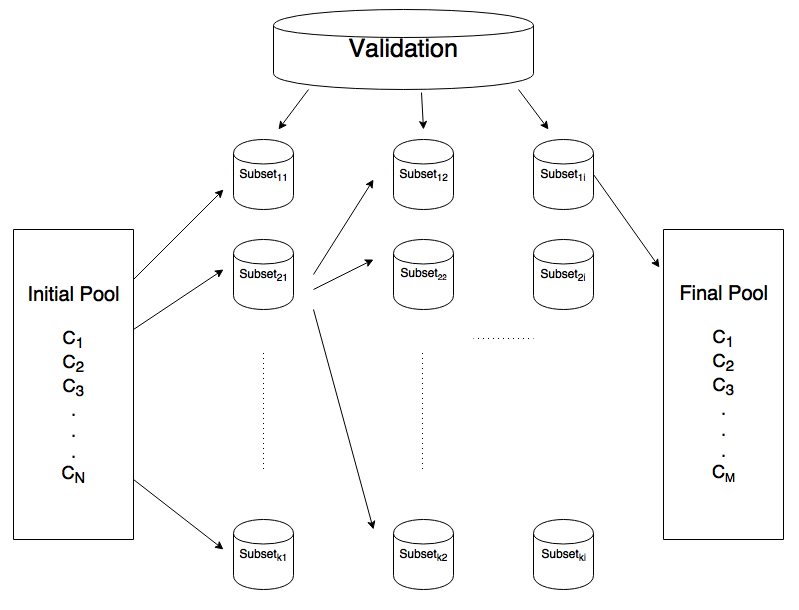

```{r setup, include=FALSE}
knitr::opts_chunk$set(echo = FALSE)
```

## Question 01
A cross-validation approach with at least three folds can be employed to assess the quality of a pruning method. In some special cases, where the pruning method needs two validation sets, a minimum of four folds may be needed.

The cross-validation process works as follows: 

1. Select one fold to be the test set, another one to be the validation set (or two depending on the pruning method), and the rest to be the training set.
2. Generate a pool of classifiers using the training set and prune it using the validation set. The pool can be generated using any method.
3. Use the original pool and the pruned pool to make predictions on the testing set, and compute the desired metrics for both pools.
4. Repeats steps 1--3 in a cyclic manner, until all folds have been used as a testing set.
5. Compute the average of the metrics and use them to compare the performance between the pools.

Suitable metrics to compare the pools would be their accuracies and diversities, as computed in the cross-validation process described before.

## Question 02
<center></center>

The proposed method is a greed procedure where the best subset of classifiers from the current pool is chosen at each step. It has two parameters: `k`, the number of subsets generated at each step, and `p`, the size reduction (in percent) relative to the size of the original pool at each step.

In greater detail, the procedure works as follows:

1. Generate a pool of classifiers.
2. Randomly select `k` subsets of classifiers from the current pool and assess their performances on the validation set. The size of each subset is the size of the current pool minus `x`, where `x` is computed as being `p%` of the size of the original pool.
3. Compare the performance of the `k` subsets against the current pool. If any of the subsets outperform the current pool, select the best subset and go to step 2. Otherwise return the current pool.

To clarify the algorithm, lets work through an example. Suppose we have a pool of $100$ classifiers, `k` is chosen to be $5$ and `p` is chosen to be $10\%$. From the original pool, $5$ subsets each containing $90$ classifiers are created and their performances assessed on a validation set. If any of the subsets outperform the original pool, we select the best and split it again in another $5$ subsets, each containing $80$ classifiers. We repeat the process until no subset of classifiers outperform the current pool.

## Question 03
For this question, the [Pima Indians Diabetes Data Set ](http://archive.ics.uci.edu/ml/datasets/Pima+Indians+Diabetes) was employed. It is a binary classification problem, containing $768$ examples described by $8$ numeric attributes. The data set can be visualised below.

```{r pima-indians}
library(readr)
pima_data <- read_csv(file.path("data", "pima.csv"), 
                      col_names = TRUE, 
                      col_types = cols(
                        Class = col_factor(c("positive", "negative"))
                      ))
DT::datatable(pima_data, class = "compact")
```

